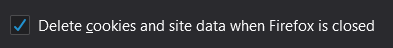
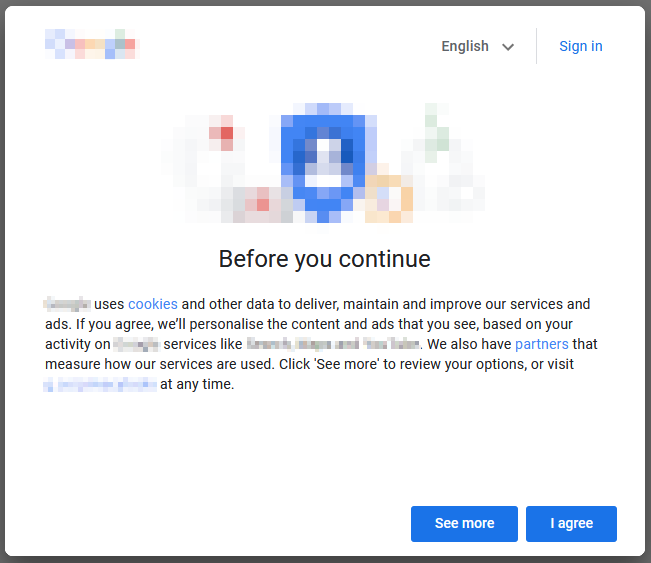

[](https://github.com/litetex/predefined-cookie-loader/actions?query=workflow%3A%22Master+CI%22)
[](https://github.com/litetex/predefined-cookie-loader/releases)
[](https://addons.mozilla.org/en-US/firefox/addon/predefined-cookie-loader/)

[](https://github.com/litetex/predefined-cookie-loader/actions?query=workflow%3A%22Develop+CI%22)
[](https://snyk.io/test/github/litetex/predefined-cookie-loader?targetFile=src/package.json)

# predefined-cookie-loader </img>

A browser extension that loads predefined 🍪 cookies into the browser 

## Install
Install from 
* [Firefox-Addons](https://addons.mozilla.org/en-US/firefox/addon/predefined-cookie-loader/)

## Use cases
### Private browsing
Your browser automatically deletes everything after you closed it? <br/>
</img>

And when you start it again everything is full of "We use cookies"-popups?<br/>
</img>

Now you can preload the corresponding cookies and surf 🏄‍ the web in peace ✌️
##### Example configuration
```JSON
{
  "<wellknownSearchEngine>.com": [
    {
      "name": "CONSENT",
      "value": "YES+undefined.undefined+V14+undefined",
      "secure": true
    }
  ],
  "<wellknownVideoPlatform>.com": [
    {
      "name": "CONSENT",
      "value": "YES+undefined.undefined+V14+undefined",
      "secure": true
    }
  ]
}
```
